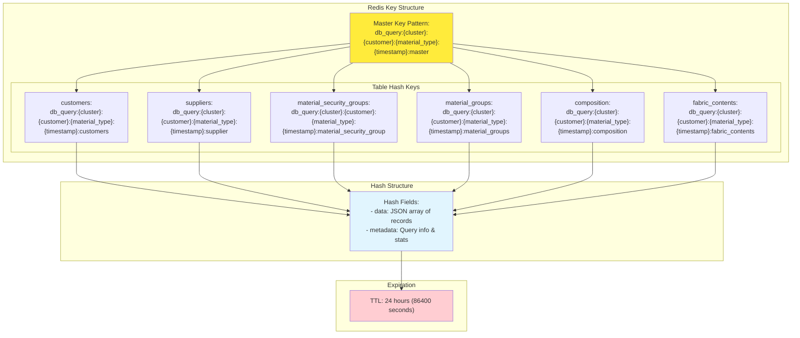
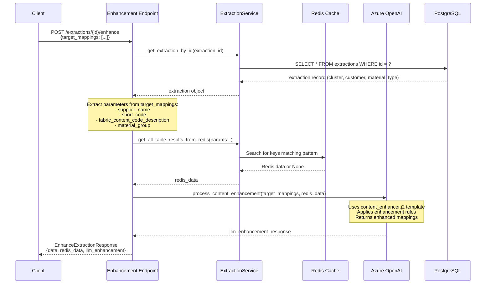
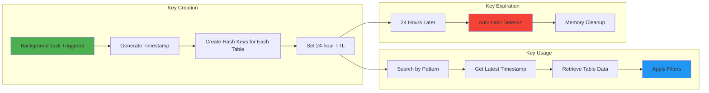

# DocIQ Enhancement Endpoint - Data Flow Diagrams

## Overview

The DocIQ enhancement endpoint (`POST /extractions/{extraction_id}/enhance`) is a sophisticated data processing pipeline that combines PostgreSQL source data, Redis caching, and AI-powered field enhancement to improve data quality and completeness.

## 1. High-Level Architecture Diagram

```mermaid
graph TB
    subgraph "Client Layer"
        CLIENT[Client Application]
    end
    
    subgraph "API Layer"
        ENDPOINT[POST /extractions/{id}/enhance]
        ROUTE[extraction.py]
    end
    
    subgraph "Service Layer"
        EXTRACT_SVC[ExtractionService]
        REDIS_SVC[Redis Service Methods]
    end
    
    subgraph "LLM Layer"
        PROMPT_UTILS[prompt_utils.py]
        ENHANCER_TEMPLATE[content_enhancer.j2]
        LLM_CONN[Azure OpenAI]
    end
    
    subgraph "Data Storage"
        POSTGRES[(PostgreSQL)]
        REDIS[(Redis Cache)]
    end
    
    CLIENT --> ENDPOINT
    ENDPOINT --> EXTRACT_SVC
    EXTRACT_SVC --> REDIS_SVC
    EXTRACT_SVC --> PROMPT_UTILS
    PROMPT_UTILS --> ENHANCER_TEMPLATE
    PROMPT_UTILS --> LLM_CONN
    REDIS_SVC --> REDIS
    EXTRACT_SVC --> POSTGRES
    
    style CLIENT fill:#e1f5fe
    style POSTGRES fill:#f3e5f5
    style REDIS fill:#fff3e0
    style LLM_CONN fill:#e8f5e8
```

## 2. PostgreSQL Source Tables & Data Flow

```mermaid
graph LR
    subgraph "PostgreSQL Database"
        subgraph "Core Tables"
            CUSTOMERS[customers<br/>- cluster<br/>- customer<br/>- id<br/>- currency]
            SUPPLIERS[suppliers<br/>- cluster<br/>- vendor_code<br/>- currency<br/>- supplier_name]
            MSG[material_security_group<br/>- cluster<br/>- customer<br/>- material_type<br/>- security_group]
        end
        
        subgraph "Reference Tables"
            MAT_GROUPS[material_groups<br/>- material_group<br/>- material_sub_group]
            COMPOSITION[composition<br/>- short_code<br/>- composition_material]
            FABRIC_CONTENTS[fabric_contents<br/>- fabric_content_code<br/>- fabric_content_code_description]
        end
    end
    
    subgraph "Query Conditions"
        COND1[cluster ILIKE '%{cluster}%'<br/>customer ILIKE '%{customer}%']
        COND2[cluster ILIKE '%{cluster}%']
        COND3[cluster ILIKE '%{cluster}%'<br/>customer ILIKE '%{customer}%'<br/>material_type ILIKE '%{material_type}%']
        COND4[SELECT * FROM table]
    end
    
    CUSTOMERS --> COND1
    SUPPLIERS --> COND2
    MSG --> COND3
    MAT_GROUPS --> COND4
    COMPOSITION --> COND4
    FABRIC_CONTENTS --> COND4
    
    style CUSTOMERS fill:#e3f2fd
    style SUPPLIERS fill:#e8f5e8
    style MSG fill:#fff3e0
    style MAT_GROUPS fill:#f3e5f5
    style COMPOSITION fill:#fce4ec
    style FABRIC_CONTENTS fill:#e0f2f1
```

## 3. Redis Storage Structure & Key Patterns



## 4. Enhancement Endpoint Processing Flow



## 5. Redis Data Retrieval & Filtering Logic

```mermaid
graph TB
    subgraph "Redis Retrieval Process"
        START[get_all_table_results_from_redis]
        PATTERN[Find keys with pattern:<br/>db_query:{cluster}:{customer}:{material_type}:*:master]
        LATEST[Get latest timestamp key]
        MASTER[Retrieve master key data]
        
        subgraph "Table Data Retrieval"
            CUSTOMERS_DATA[Retrieve customers data]
            SUPPLIERS_DATA[Retrieve suppliers data<br/>Filter by supplier_name if provided]
            MSG_DATA[Retrieve material_security_groups data]
            MG_DATA[Retrieve material_groups data<br/>Filter by material_group if provided]
            COMP_DATA[Retrieve composition data<br/>Filter by short_code if provided]
            FC_DATA[Retrieve fabric_contents data<br/>Filter by fabric_content_code_description]
        end
        
        RESULT[Return organized results:<br/>{customers: [], suppliers: [],<br/>material_security_groups: [],<br/>material_groups: [], composition: [],<br/>fabric_contents: []}]
    end
    
    START --> PATTERN
    PATTERN --> LATEST
    LATEST --> MASTER
    MASTER --> CUSTOMERS_DATA
    MASTER --> SUPPLIERS_DATA
    MASTER --> MSG_DATA
    MASTER --> MG_DATA
    MASTER --> COMP_DATA
    MASTER --> FC_DATA
    
    CUSTOMERS_DATA --> RESULT
    SUPPLIERS_DATA --> RESULT
    MSG_DATA --> RESULT
    MG_DATA --> RESULT
    COMP_DATA --> RESULT
    FC_DATA --> RESULT
    
    style START fill:#4caf50
    style RESULT fill:#2196f3
```

## 6. LLM Enhancement Rules & Field Transformations

```mermaid
graph TB
    subgraph "Enhancement Rules Engine"
        INPUT[Target Mappings Input]
        REDIS_CHECK{Redis Data Available?}
        
        subgraph "Redis-Based Enhancements"
            SUPPLIER_RULE[Supplier → suppliers.vendor_code]
            CUSTOMER_RULE[Customer → customers.id]
            CURRENCY_RULE[Currency → suppliers.currency]
            MAT_TYPE_RULE[Material Type → material_security_groups.material_type]
            MAT_SEC_RULE[Material Security Group → material_security_groups.security_group]
            MAT_SUB_RULE[Material Sub Group → composition.composition_material]
            COMPOSITION_RULE[Composition → fabric_contents.fabric_content_code]
            MAT_GROUP_RULE[Material Group → material_groups values]
            CLUSTER_RULE[Cluster → customers.cluster]
        end
        
        subgraph "Normalization Rules"
            WIDTH_UOM_RULE[Width UOM: "inches" → '"']
            UOM_RULE[UOM: "Yd"/"Yds" → "Yards"]
            GRID_RULE[Material Master Grid: "can't specify" → "No Grid"]
            SOURCE_RULE[Source Type: empty → "Nominated"]
        end
        
        OUTPUT[Enhanced Mappings with Confidence Levels]
    end
    
    INPUT --> REDIS_CHECK
    REDIS_CHECK -->|Yes| SUPPLIER_RULE
    REDIS_CHECK -->|Yes| CUSTOMER_RULE
    REDIS_CHECK -->|Yes| CURRENCY_RULE
    REDIS_CHECK -->|Yes| MAT_TYPE_RULE
    REDIS_CHECK -->|Yes| MAT_SEC_RULE
    REDIS_CHECK -->|Yes| MAT_SUB_RULE
    REDIS_CHECK -->|Yes| COMPOSITION_RULE
    REDIS_CHECK -->|Yes| MAT_GROUP_RULE
    REDIS_CHECK -->|Yes| CLUSTER_RULE
    
    INPUT --> WIDTH_UOM_RULE
    INPUT --> UOM_RULE
    INPUT --> GRID_RULE
    INPUT --> SOURCE_RULE
    
    SUPPLIER_RULE --> OUTPUT
    CUSTOMER_RULE --> OUTPUT
    CURRENCY_RULE --> OUTPUT
    MAT_TYPE_RULE --> OUTPUT
    MAT_SEC_RULE --> OUTPUT
    MAT_SUB_RULE --> OUTPUT
    COMPOSITION_RULE --> OUTPUT
    MAT_GROUP_RULE --> OUTPUT
    CLUSTER_RULE --> OUTPUT
    WIDTH_UOM_RULE --> OUTPUT
    UOM_RULE --> OUTPUT
    GRID_RULE --> OUTPUT
    SOURCE_RULE --> OUTPUT
    
    style INPUT fill:#e3f2fd
    style OUTPUT fill:#e8f5e8
    style REDIS_CHECK fill:#fff3e0
```

## 7. Complete Data Flow: From Upload to Enhancement

```mermaid
graph TB
    subgraph "Phase 1: Document Upload"
        UPLOAD[POST /extractions/<br/>Headers: X-Cluster, X-Customer, X-Material-Type]
        CREATE_DOC[Create Document & Extraction Records]
        MISTRAL[Process with Mistral AI]
        BG_TASK[Background Task: Query PostgreSQL Tables]
        STORE_REDIS[Store Results in Redis with TTL]
    end
    
    subgraph "Phase 2: Template Mapping"
        SELECT_TEMPLATE[Select Template]
        MAP_CONTENT[Map Content to Template Fields]
        TARGET_MAPPINGS[Generate Target Mappings]
    end
    
    subgraph "Phase 3: Enhancement"
        ENHANCE_REQUEST[POST /extractions/{id}/enhance]
        EXTRACT_PARAMS[Extract Parameters from Target Mappings]
        RETRIEVE_REDIS[Retrieve & Filter Redis Data]
        LLM_ENHANCE[LLM Enhancement with Rules]
        ENHANCED_RESPONSE[Return Enhanced Data]
    end
    
    UPLOAD --> CREATE_DOC
    CREATE_DOC --> MISTRAL
    MISTRAL --> BG_TASK
    BG_TASK --> STORE_REDIS
    
    STORE_REDIS --> SELECT_TEMPLATE
    SELECT_TEMPLATE --> MAP_CONTENT
    MAP_CONTENT --> TARGET_MAPPINGS
    
    TARGET_MAPPINGS --> ENHANCE_REQUEST
    ENHANCE_REQUEST --> EXTRACT_PARAMS
    EXTRACT_PARAMS --> RETRIEVE_REDIS
    RETRIEVE_REDIS --> LLM_ENHANCE
    LLM_ENHANCE --> ENHANCED_RESPONSE
    
    style UPLOAD fill:#4caf50
    style ENHANCED_RESPONSE fill:#2196f3
    style STORE_REDIS fill:#ff9800
    style LLM_ENHANCE fill:#9c27b0
```

## 8. Field Enhancement Examples

### Example 1: Supplier Enhancement
```json
// Input Target Mapping
{
  "target_field": "Supplier",
  "target_value": "ABC Company"
}

// Redis Data (suppliers table)
{
  "suppliers": [
    {"vendor_code": "SUP001", "currency": "USD", "supplier_name": "ABC Company"}
  ]
}

// Enhanced Output
{
  "target_field": "Supplier",
  "target_value": "SUP001",
  "target_confidence": "enhanced"
}
```

### Example 2: UOM Normalization
```json
// Input Target Mapping
{
  "target_field": "UOM",
  "target_value": "Yds"
}

// Enhanced Output (no Redis needed)
{
  "target_field": "UOM", 
  "target_value": "Yards",
  "target_confidence": "enhanced"
}
```

### Example 3: Material Groups Processing
```json
// Input Target Mapping
{
  "target_field": "Material Group",
  "target_value": "Weft Knit"
}

// Redis Data (material_groups table)
{
  "material_groups": ["SJ", "Interlock", "Single Jersey"]
}

// Enhanced Output
{
  "target_field": "Material Group",
  "target_value": "SJ,Interlock,Single Jersey",
  "target_confidence": "enhanced"
}
```

## 9. Redis Key Lifecycle & Management



## 10. Error Handling & Fallback Mechanisms

```mermaid
graph TB
    subgraph "Error Scenarios"
        REDIS_DOWN[Redis Connection Failed]
        NO_DATA[No Redis Data Found]
        LLM_ERROR[LLM Processing Error]
        PARSE_ERROR[JSON Parse Error]
    end
    
    subgraph "Fallback Actions"
        REDIS_FALLBACK[Continue without Redis data<br/>redis_data = None]
        ORIGINAL_VALUES[Keep original target_mappings<br/>confidence = "original"]
        ERROR_RESPONSE[Return error in llm_enhancement<br/>status = "error"]
        GRACEFUL_DEGRADE[Return partial results<br/>with error details]
    end
    
    REDIS_DOWN --> REDIS_FALLBACK
    NO_DATA --> ORIGINAL_VALUES
    LLM_ERROR --> ERROR_RESPONSE
    PARSE_ERROR --> GRACEFUL_DEGRADE
    
    REDIS_FALLBACK --> ORIGINAL_VALUES
    ERROR_RESPONSE --> GRACEFUL_DEGRADE
    
    style REDIS_DOWN fill:#ffcdd2
    style LLM_ERROR fill:#ffcdd2
    style GRACEFUL_DEGRADE fill:#c8e6c9
```

## Summary

The DocIQ enhancement endpoint implements a sophisticated data processing pipeline that:

1. **Sources data** from 6 PostgreSQL tables using flexible ILIKE queries
2. **Caches results** in Redis with structured hash keys and 24-hour TTL
3. **Applies intelligent filtering** based on extracted parameters from target mappings
4. **Uses AI enhancement** with structured rules to improve data quality
5. **Provides fallback mechanisms** for robust error handling
6. **Returns comprehensive results** including original data, Redis context, and AI enhancements

The system is designed for high performance, reliability, and maintainability in enterprise manufacturing environments.
